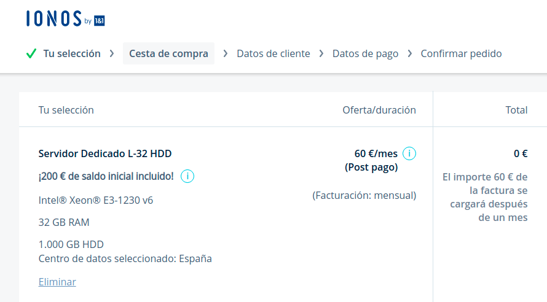
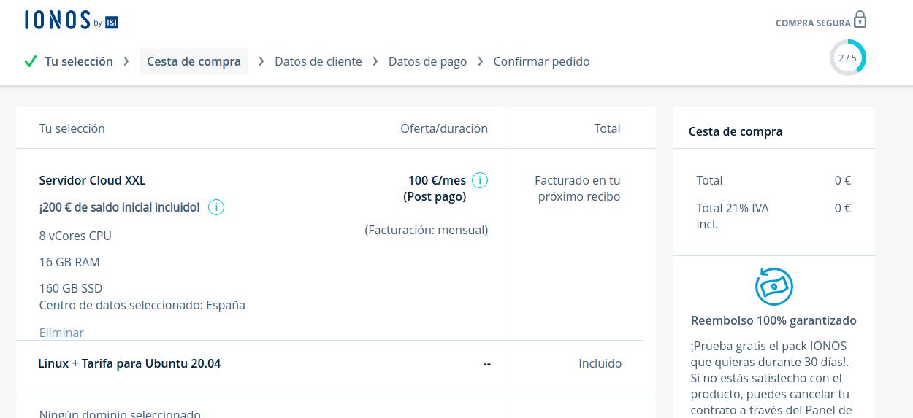
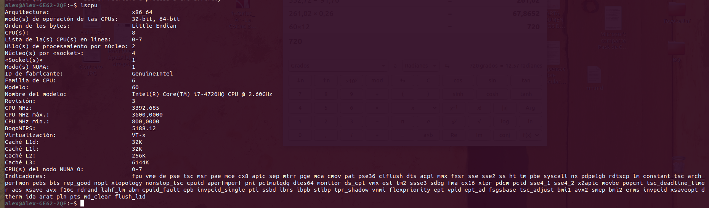
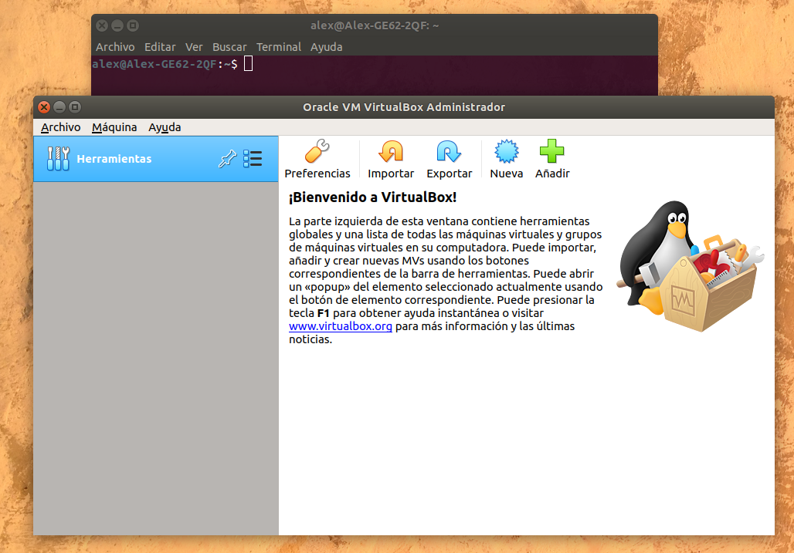

### [Semana 1](http://jj.github.io/IV/documentos/temas/Intro_concepto_y_soporte_fisico)

**Autor:** Alejandro rodríguez López


**Ejercicio 1)**
*Consultar en el catálogo de alguna tienda de informática el precio de un ordenador tipo servidor y calcular su coste de amortización a cuatro y siete años. Consultar este artículo en Infoautónomos sobre el tema.*

He consultado el catalogo de PCcomponentes y he elegido este servidor:
**HPE ProLiant DL360 Gen10 Intel Xeon Silver 4214R/32GB**
Con un precio de: 2.599€ IVA incluido.

Su precio sin IVA es de 2.147,93€, con lo cual ya conocemos su base imponible.

Vamos a calcular el coste de amortización anual para 4 años,
sabemos que el máximo de amortización anual es el 26%.

0.26 * 2.147,93€ =558,46€
Con lo cual eso sería la cantidad maxima de amortización al año suponiendo que incluyamos el año completo.

en este caso plantearé la adquisición del equipo el día 1 de Ocutubre de 2020.

|Año|Valor|Amortización|
|-|-|-|
|2020|2.147,93€|558,46€|
|2021|1589,47€|413,26€|
|2022|1176,21€|305,81€|
|2023|870,4€|226,30€|
|2024|644,1€|167,46€|
|2025|476,64€|123,92€|
|2026|352,72€|91,70€|
|2027|261,02€|67,86€|

La tabla incluye la amortización en 7 años y por consiguiente en 4.


**Ejercicio 2)**
*Usando las tablas de precios de servicios de alojamiento en Internet “clásicos”, es decir, que ofrezcan Virtual Private Servers o servidores físicos, y de proveedores de servicios en la nube, comparar el coste durante un año de un ordenador con un procesador estándar (escogerlo de forma que sea el mismo tipo de procesador en los dos vendedores) y con el resto de las características similares (tamaño de disco duro equivalente a transferencia de disco duro) en el caso de que la infraestructura comprada se usa solo el 1% o el 10% del tiempo.*

Precio anual de un servidor dedicado: 60€/Mes unos 720€/Año

 


Precio anual de un servicio de alojamiento en la nube: 100€/Mes unos 1200€/Año

  

He consultado el catalogo de PCcomponentes y he elegido este servidor:
**HPE ProLiant DL360 Gen10 Intel Xeon Silver 4214R/32GB**
Con un precio de: 2.599€ IVA incluido.

**Resumen:**

|Versión|Coste
|-|-|
|Clasica|720€/Año
|Física|2.599€
|Cloud|1200€/Año

Si planteamos el caso de que la infraestructura comprada se usa solo el 1% o el 10% del tiempo podemos rentabilizar aún mas las versión **cloud**, ya que ofrecen **Pay per use**.


**Ejercicio 3)**
*En general, cualquier ordenador con menos de 5 o 6 años tendrá estos flags. ¿Qué modelo de procesador es? ¿Qué aparece como salida de esa orden? Si usas una máquina virtual, ¿qué resultado da? ¿Y en una Raspberry Pi o, si tienes acceso, el procesador del móvil?*

**Comando:**
`egrep '^flags.*(vmx|svm)' /proc/cpuinfo
`


**Salida:**
```
flags		: fpu vme de pse tsc msr pae mce cx8 apic sep mtrr pge mca cmov pat pse36 clflush dts acpi mmx fxsr sse sse2 ss ht tm pbe syscall nx pdpe1gb rdtscp lm constant_tsc arch_perfmon pebs bts rep_good nopl xtopology nonstop_tsc cpuid aperfmperf pni pclmulqdq dtes64 monitor ds_cpl vmx est tm2 ssse3 sdbg fma cx16 xtpr pdcm pcid sse4_1 sse4_2 x2apic movbe popcnt tsc_deadline_timer aes xsave avx f16c rdrand lahf_lm abm cpuid_fault epb invpcid_single pti ssbd ibrs ibpb stibp tpr_shadow vnmi flexpriority ept vpid ept_ad fsgsbase tsc_adjust bmi1 avx2 smep bmi2 erms invpcid xsaveopt dtherm ida arat pln pts md_clear flush_l1d

```

 


**Ejercicio 4)**
*Instalar un hipervisor para gestionar máquinas virtuales, que más adelante se podrá usar en pruebas y ejercicios. Usar siempre que sea posible un hipervisor que sea software libre.*

Utilizaré **Virtual box**.
[VirtualBox](https://www.virtualbox.org/wiki/Linux_Downloads) 

 


**Ejercicio 5)**
*Darse de alta en una web que permita hacer pruebas con alguno de los sistemas de gestión de nube libres como los mencionados en los párrafos anteriores, aunque sea temporalmente. Si la prueba es menos de un mes, simplemente anotarlo y dejarlo para el mes de diciembre, más o menos.*


[Volver al repositorio](https://github.com/alexrodriguezlop/EjerciciosIV2021)