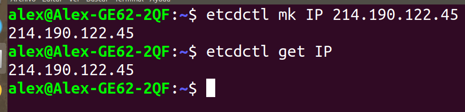
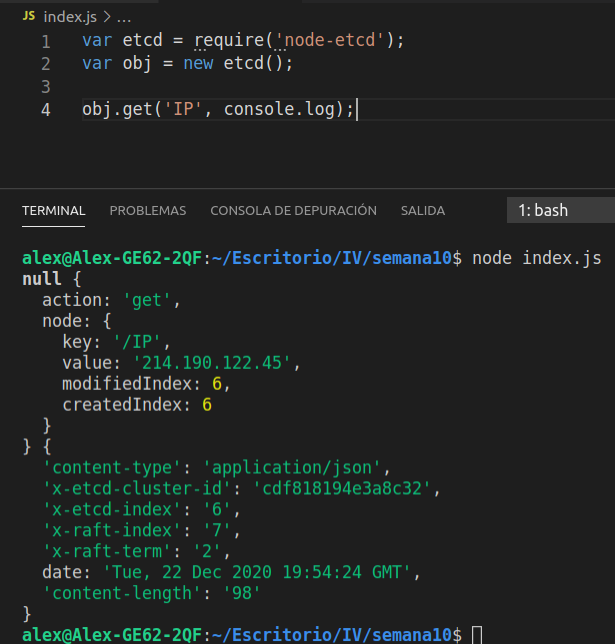
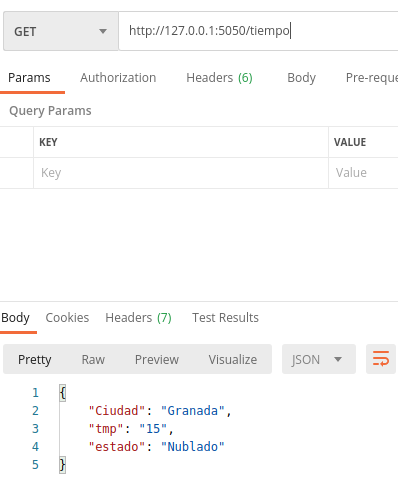
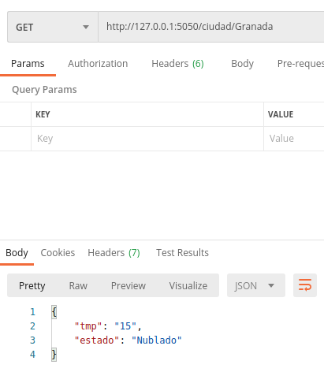
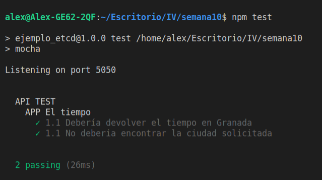

### [Semana 10](http://jj.github.io/IV/documentos/temas/Microservicios)

**Autor:** Alejandro rodríguez López

**Ejercicio 1:**

*Instalar etcd3, averiguar qué bibliotecas funcionan bien con el lenguaje que estemos escribiendo el proyecto (u otro lenguaje), y hacer un pequeño ejemplo de almacenamiento y recuperación de una clave; hacer el almacenamiento desde la línea de órdenes (con etcdctl) y la recuperación desde el mini-programa que hagáis.*

Instalamos etcd:

`apt install etcd-server`

Un cliente de línea de comandos para etcd

`apt install etcd-client `

Despues de consultar el manual de etcdctl sabemos los comandos básicos:

- **mk** key valor
- **rm** key
- **get** key
- **updaqte** key 





**Ejercicio 2:**

*Realizar una aplicación básica que use express para devolver alguna estructura de datos del modelo que se viene usando en el curso.*

```
var express = require("express");
var app = express();

tiempo = {
    Ciudad:'Granada',
    tmp:'15', 
    estado:'Nublado'
};

app.get("/tiempo", function(req, res){
    res.setHeader("Content-Type","application/json");
    res.status(200);
    res.send(tiempo);
});


app.listen(5050);
console.log("Listening on port 5050");
```



**Ejercicio 3:**

*Programar un microservicio en express (o el lenguaje y marco elegido) que incluya variables como en el caso anterior.*

```
var express = require("express");
var app = express();

 app.get("/ciudad/:name", function(req, res){
    var status;
    if(req.params.name == "Granada"){
        tiempo = {
            tmp:'15', 
            estado:'Nublado'
        };
        status = 200;
    }
    else{
        tiempo = {
           msg:'Ciudad no encontrada'
        };
        status = 404;
    }
    res.setHeader("Content-Type","application/json");
    res.status(status);
    res.send(tiempo);
});

app.listen(5050);
console.log("Listening on port 5050");

module.exports = {app};
```


**Ejercicio 4:**

*Crear pruebas para las diferentes rutas de la aplicación.*

```
const chai = require('chai');
const chaiHttp = require('chai-http');
const assert = require('chai').assert;
const expect = require('chai').expect;


// Importando el servidor
const {app} = require('./index.js');

chai.use(chaiHttp);


describe("API TEST", function() {
    context('APP El tiempo', function(){

        it("1.1 Debería devolver el tiempo en Granada", function() {
            chai.request(app)
            .get('/ciudad/Granada')
            .end( function(err,res){
                expect(res).to.have.status(200);
                assert.typeOf(JSON, 'JSON', 'JSON');
            });
        });

        it("1.1 No deberia encontrar la ciudad solicitada", function() {
            chai.request(app)
            .get('/ciudad/Cadiz')
            .end( function(err,res){
                expect(res).to.have.status(404);
                assert.typeOf(JSON, 'JSON', 'JSON');
            });
        });
    });
});

```




