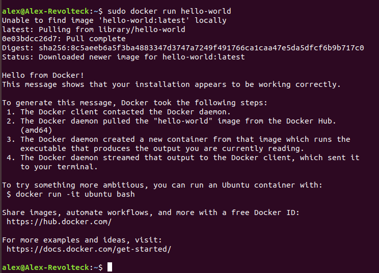

### [Semana 4](http://jj.github.io/IV/documentos/temas/Contenedores)

**Autor:** Alejandro rodríguez López

**Ejercicio 1)**
*Instalar docker y/o otro gestor de contenedores como Podman/Buildah.*

Se ha seguido esta [guía](https://www.hostinger.es/tutoriales/como-instalar-y-usar-docker-en-ubuntu/)

 

[Volver al repositorio](https://github.com/alexrodriguezlop/EjerciciosIV2021)