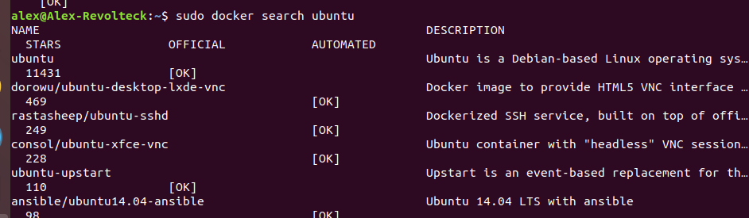

### [Semana 4](http://jj.github.io/IV/documentos/temas/Contenedores)

**Autor:** Alejandro rodríguez López

**Ejercicio 1)**

*Instalar docker y/o otro gestor de contenedores como Podman/Buildah.*

Se ha seguido esta [guía](https://www.hostinger.es/tutoriales/como-instalar-y-usar-docker-en-ubuntu/)

 

**Ejercicio 2)**

**A)** *Instalar a partir de docker una imagen alternativa de Ubuntu y alguna adicional, por ejemplo de CentOS.*

`sudo docker search ubuntu`

 

`sudo docker pull ubuntu`

 

Se repite el proceso con CentOs

**B)** *Buscar e instalar una imagen que incluya MongoDB.*

`sudo docker search mongoDB`

 

`sudo docker pull centos/mongodb-34-centos7`

 

**Ejercicio 3)**

*Crear un usuario propio e instala alguna aplicación tal como nginx en el contenedor creado de esta forma, usando las órdenes propias del sistema operativo con el que se haya inicializado el contenedor.*

[Volver al repositorio](https://github.com/alexrodriguezlop/EjerciciosIV2021)