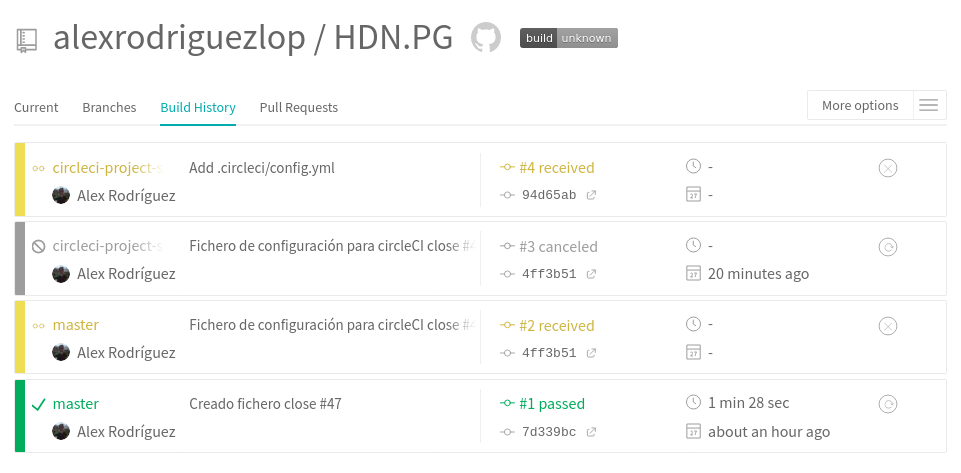

### [Semana 6](http://jj.github.io/IV/documentos/temas/Desarrollo_basado_en_pruebas#a%C3%B1adiendo-integraci%C3%B3n-continua)

**Autor:** Alejandro rodríguez López

**Paso1 - Crear cuenta en [Travis](https://travis-ci.org/)**


**Paso2 - Activar el repositorio en el que se vaya a aplicar la integración continua**

`Perfil -> settings -> Activar Travis en el repostitorio`


**Ejercicio 9)**
**Paso3 - Crear un fichero de configuración para que se ejecute la integración y añadirlo al repositorio.**

```
language: node_js
node_js:
  - "12"
  - "14"
before_install:
  - npm install -g gulp-cli
script: gulp test

```
[Fichero en repositorio](https://github.com/alexrodriguezlop/HDN.PG/blob/master/.travis.yml)


**Ejercicio 10)**
*Configurar integración continua para nuestra aplicación usando Travis o algún otro sitio.*



**Estado del build:**
[](https://travis-ci.org/alexrodriguezlop/HDN.PG)