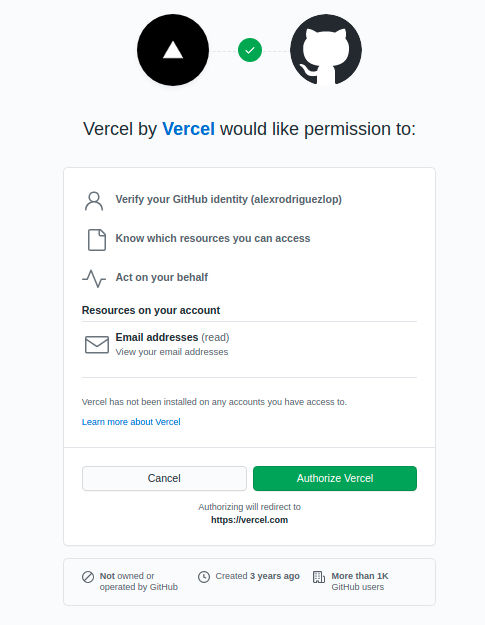
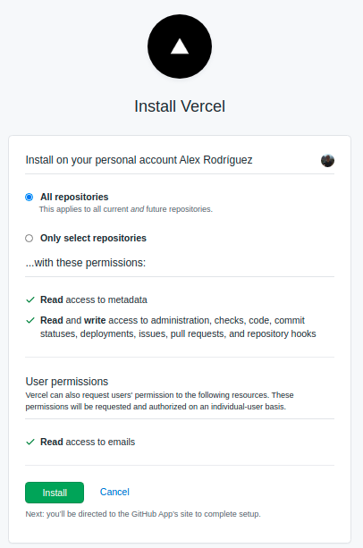
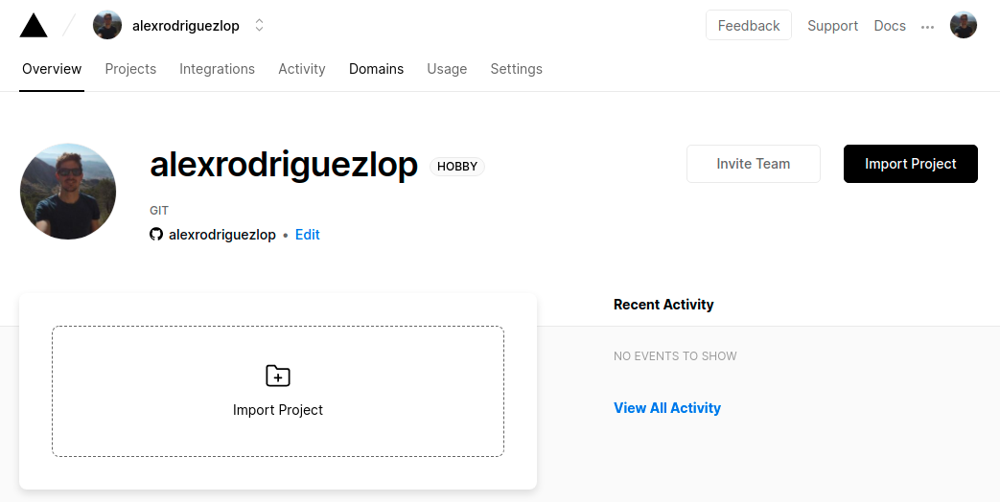
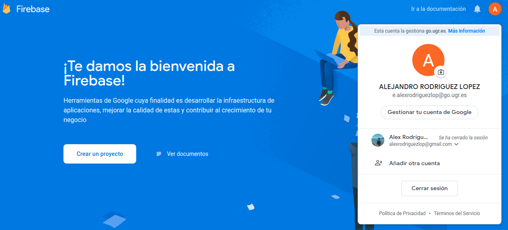

### [Semana 9](http://jj.github.io/IV/documentos/temas/Serverless)

**Autor:** Alejandro rodríguez López

**Ejercicio 1:**
Darse de alta en Vercel y Firebase, y descargarse los SDKs para poder trabajar con ellos localmente.

**Vercel:**

Iniciamos sesión con nuestra cuenta de GitHub.

Instalamos vercel en nuestra cuenta de GitHub, en este caso le he dado permisos sobre todos los repositorios aunque se puede especificar uno en concreto.

Mi perfil está creado y vinculado con mi cuenta de GitHub.
es un plan HOBBY con lo cual su suo es gratuito.

Para instalar el CLI de vercel usaremos el siguiente comando:

`npm i -g vercel`

**Firebase:**

Iniciamos sesión en firebase con una cuenta de google.

Para instalar el CLI de firebase usaremos el siguiente comando:

`npm install -g firebase-tools`

Una vez instalado nos loguearemos.

`firebase login`

**Ejercicio 2:**
Tomar alguna de las funciones de prueba de Vercel, y hacer despliegues de prueba con el mismo.
Instalar vercel 

`npm i -g vercel`

**Ejercicio 3:**