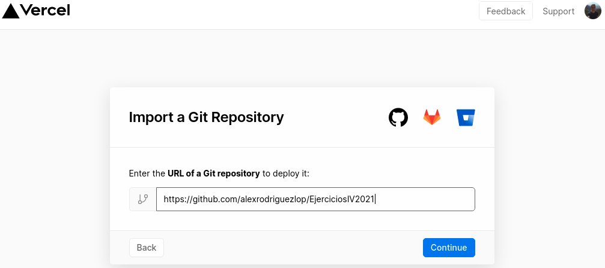
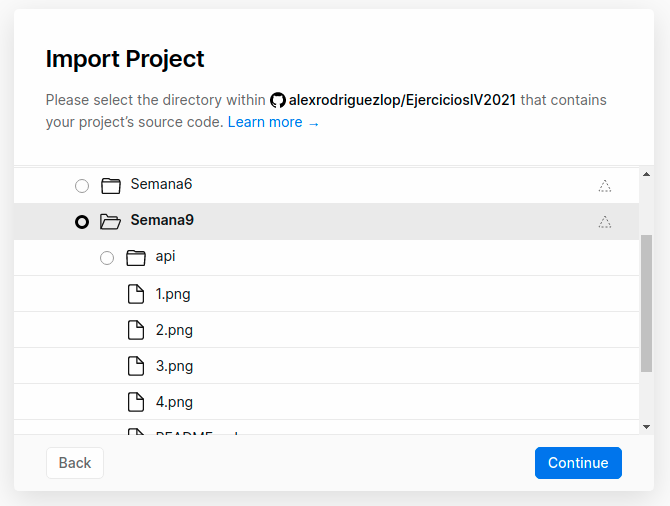
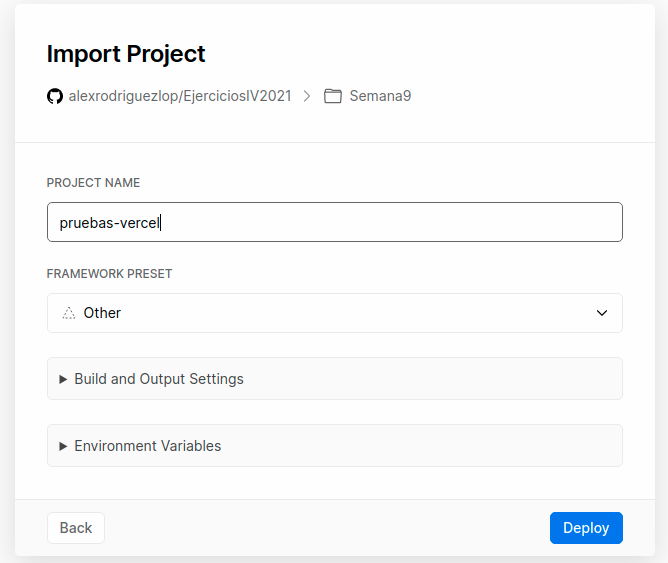
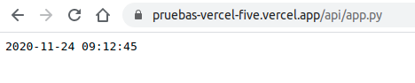
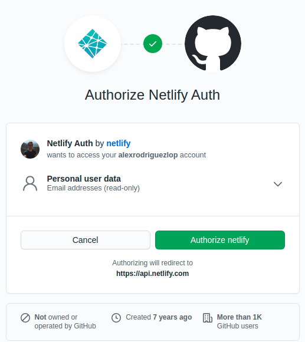
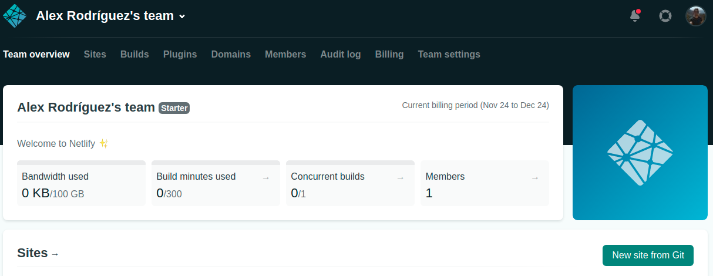
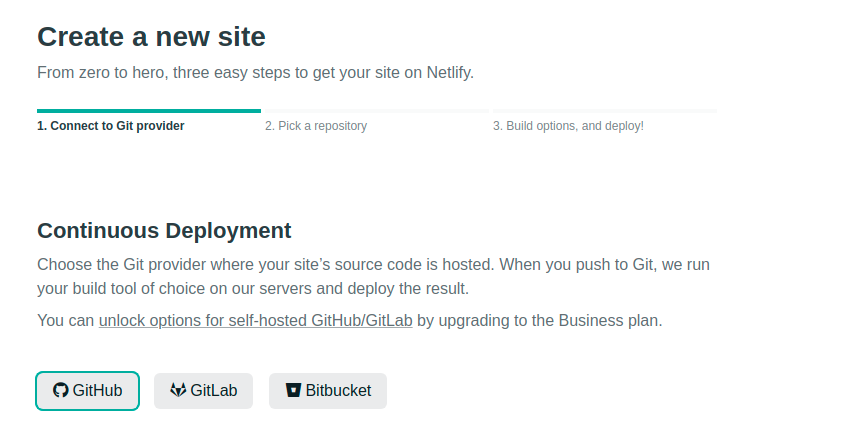
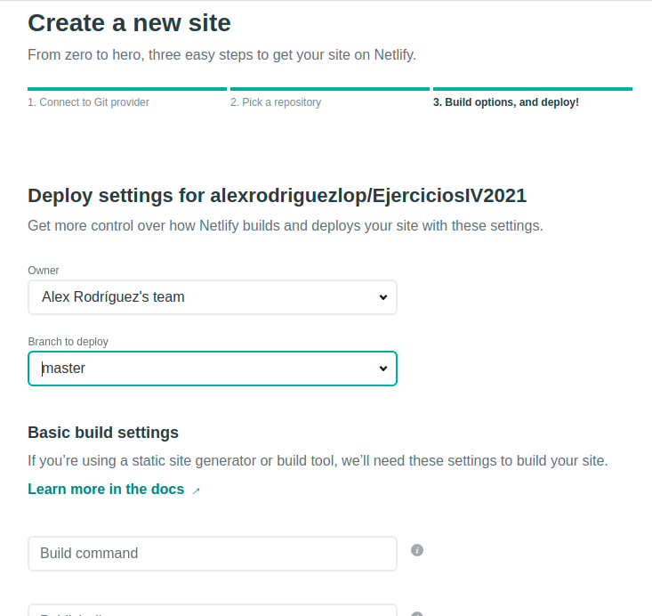
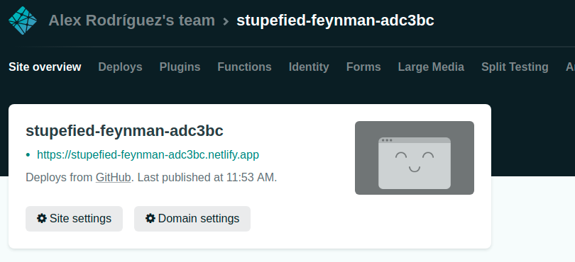
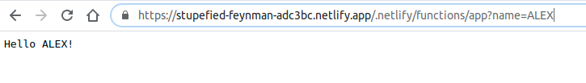

### [Semana 9](http://jj.github.io/IV/documentos/temas/Serverless)

**Autor:** Alejandro rodríguez López

**Ejercicio 1:**
Darse de alta en Vercel y Firebase, y descargarse los SDKs para poder trabajar con ellos localmente.

**Vercel:**

Iniciamos sesión con nuestra cuenta de GitHub.


Instalamos vercel en nuestra cuenta de GitHub, en este caso le he dado permisos sobre todos los repositorios aunque se puede especificar uno en concreto.


Mi perfil está creado y vinculado con mi cuenta de GitHub.
es un plan HOBBY con lo cual su uso es gratuito.


Para instalar el CLI de vercel usaremos el siguiente comando:

`npm i -g vercel`


**Firebase:**

Iniciamos sesión en firebase con una cuenta de google.


Para instalar el CLI de firebase usaremos el siguiente comando:


`npm install -g firebase-tools`

Una vez instalado nos loguearemos.

`firebase login`

**Ejercicio 2:**
Tomar alguna de las funciones de prueba de Vercel, y hacer despliegues de prueba con el mismo.

Tomamos un ejemplo de vercel escrito en python:

```
from http.server import BaseHTTPRequestHandler
from datetime import datetime

class handler(BaseHTTPRequestHandler):

  def do_GET(self):
    self.send_response(200)
    self.send_header('Content-type', 'text/plain')
    self.end_headers()
    self.wfile.write(str(datetime.now().strftime('%Y-%m-%d %H:%M:%S')).encode())
    return

```
Importamos el repositorio de GitHub:




Importamos el proyecto especificando donde se encuentran los ficheros fuente.

Si nuestro proyecto dispone de ficheros complementarios y estos se encuentran en la raíz del directorio especificaremos dicho directorio.



Establecemos los parámetros básicos de configuración para nuestro proyecto.

En este caso particular solo hemos proporcionado un nombre.



Verificamos que el [despliegue](https://pruebas-vercel-five.vercel.app/api/app) ha sido correcto y la función funciona:

 


Podemos instalar Vercel y usar su Cli para trabajar desde nuestra terminal usando:

Instalamos vercel 

`npm i -g vercel`

Podemos ejecutar la orden `vercel` para crear nuestro proyecto.


**Ejercicio 3:**
Tomar alguna de las funciones de prueba de Netlify, y hacer despliegues de prueba con el mismo.

Función usada:

```
// functions/hello.js
exports.handler = async event => {
    const subject = event.queryStringParameters.name || 'World'
    return {
      statusCode: 200,
      body: `Hello ${subject}!`,
    }
  }
```

Autorizamos la aplicación en GitHub:

 

Creamos un nuevo sitio.

 

Partimos desde nuestro repositorio de GitHub:

 

Establecemos los ajustes de nuestro sitio:

En este caso todos los ajuste por defecto van acordes a nuestras necesidades.

 

El sitio ha sido creado.

 

Posteriormente debemos crear el fichero de configuración de netlify en nuestro repositorio para indicarle algunos parámetros como la ruta de la función:

```
[build]

  functions = "./Semana9/functions"
```

El fichero se llamará **netlify.toml**.

Verificamos que el [despliegue](https://stupefied-feynman-adc3bc.netlify.app/.netlify/functions/app?name=ALEX) ha sido correcto y la función funciona:

 


El despliegue en Netlify se ha hecho de a cuerdo con esta [guía](https://kentcdodds.com/blog/super-simple-start-to-netlify-functions)